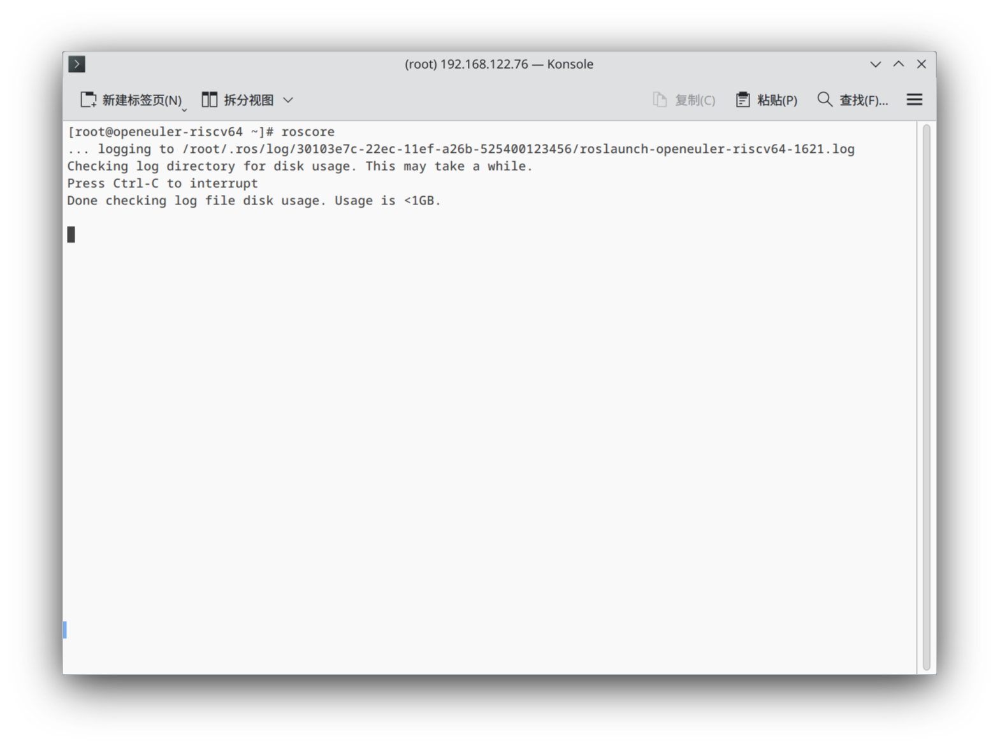

## ROS2 Noetic 在 openEuler 24.03 riscv 架构上的测试

### 概述

目前 openEuler 移植的 ros noetic 相关软件包较少，无法覆盖太多功能，经测试可以安装相关软件包与启动 roscore 服务。

### 环境信息

#### 硬件信息：

1. QEMU openEuler riscv64 虚拟机，QEMU emulator version 9.0.0
2. 处理器 smp 8
3. 内存 8GB

#### 软件信息

1. OS 版本：openEuler-24.03-LTS risc-v
2. 镜像地址：[https://mirror.iscas.ac.cn/openeuler-sig-riscv/openEuler-RISC-V/testing/20240602/v0.2/QEMU/openEuler-24.03-V1-base-qemu-testing.qcow2.zst](https://mirror.iscas.ac.cn/openeuler-sig-riscv/openEuler-RISC-V/testing/20240602/v0.2/QEMU/openEuler-24.03-V1-base-qemu-testing.qcow2.zst)
3. 软件源：[https://mirror.iscas.ac.cn/openeuler-sig-riscv/openEuler-RISC-V/testing/20240602/v0.2/](https://mirror.iscas.ac.cn/openeuler-sig-riscv/openEuler-RISC-V/testing/20240602/v0.2/)
4. ROS 软件源：[https://build-repo.tarsier-infra.isrc.ac.cn/home:/taro:/ROS:/noetic/24.03/](https://build-repo.tarsier-infra.isrc.ac.cn/home:/taro:/ROS:/noetic/24.03/)


## 启动虚拟机

在 x86 的机器上需要安装 `qemu-system-riscv64` 来启动 riscv64 的虚拟机，首先获取 [启动脚本](https://mirror.iscas.ac.cn/openeuler-sig-riscv/openEuler-RISC-V/testing/2403LTS-test/v1/QEMU/start_vm.sh) 和 [虚拟机固件](https://mirror.iscas.ac.cn/openeuler-sig-riscv/openEuler-RISC-V/testing/2403LTS-test/v1/QEMU/fw_payload_oe_uboot_2304.bin) 到虚拟机同目录，将上述的镜像解压，在该目录下执行以下命令即可启动虚拟机：

```bash
bash start_vm.sh
```

## 配置软件源

复制 [ROS.repo](./ROS.repo) 到  `/etc/yum.repos.d/ROS.repo`，**或者** 执行以下命令

```bash
bash -c 'cat << EOF > /etc/yum.repos.d/ROS.repo
[openEulerROS-humble]
name=openEulerROS-humble
baseurl=https://build-repo.tarsier-infra.isrc.ac.cn/home:/taro:/ROS:/noetic/24.03/
enabled=1
gpgcheck=0
EOF'
```

然后执行 `dnf update`

### 安装 ROS-humble 列表软件

```bash
dnf install ros-noetic* --skip-broken --exclude=ros-noetic-ros-comm -y
```

安装列表中的软件包，`ros-noetic-ros-comm` 与其他包有冲突，导致 ros noetic 相关软件包无法安装，经测试 x86 结构也有该问题。

### 卸载 ROS-humble 列表软件

执行

```bash
dnf remove ros-noetic*
```

命令正常执⾏，所有软件包被卸载。


## 功能测试

安装上述软件列表后，进行环境配置：

在 `~/.bashrc` 追加 `source /opt/ros/noetic/setup.bash`

执行 `source ~/.bashrc `，引入 ROS1 环境。


### 测试 ros 基础工具相关功能

#### 验证 roscore 是否可以正常启动

执行

```bash
roscore
```

如图，ros 服务正常启动，测试通过



